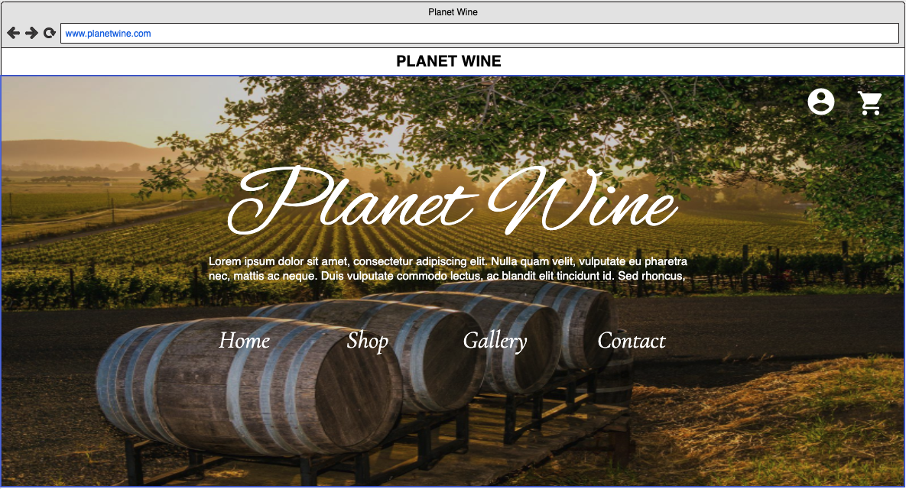
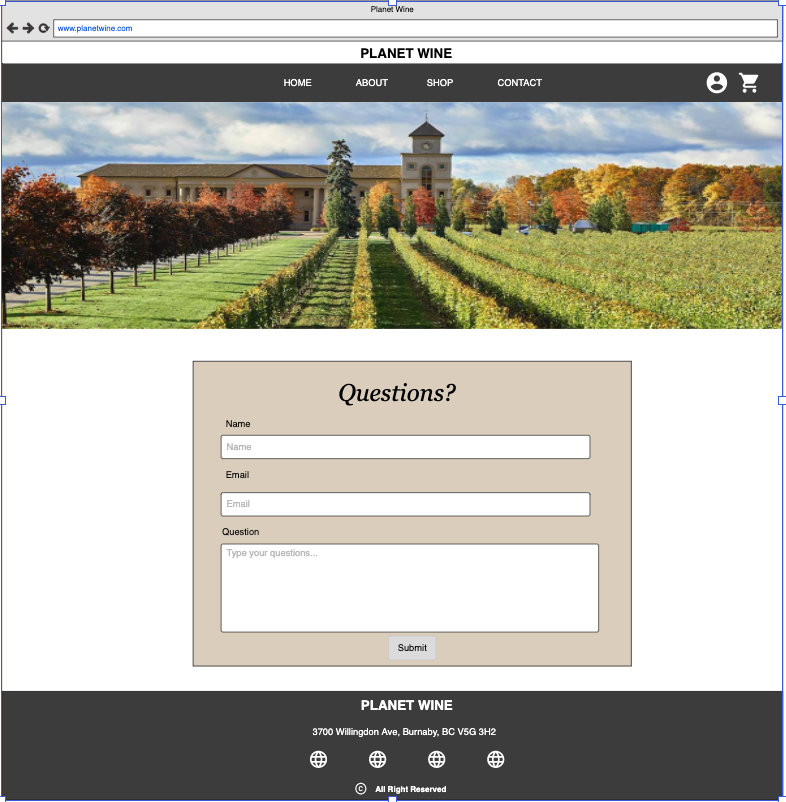

# Food Ecommerce website | Planet Wine

###### Karen Mok, Steven Lai, Jianming tu, Wayne Lee, Kalvin Tang

An eccommerce website about selling wine

## Roles

-   Project Manager / Scrum Master: KAREN MOK!

-   WireFrame: Karen, Steven, Kalvin
-   HTML: Kalvin, Karen, Wayne
-   CSS: Karen, Steven, Kalvin, Jimmy
-   Javascript: Wayne, Jimmy, Steven

-   Github to do list: Everyone

## Site Description & Purpose

### Functional

-   Login/Register
-   Navigation
-   Shopping Cart/Checkout

### Non-functional

-   18+ popup
-   Search
-   Sorting/Filtering
-   User shopping cart interactions

## Pages

-   Login
-   Register
-   Gallery
-   Landing Page
-   Shop
-   Contact

## Designs

### Color Palette

-   #f0ece3
-   #dfd3c3
-   #c7b198
-   #596e79

### Font Choice

<!-- <link href="https://fonts.googleapis.com/css2?family=Cormorant:ital,wght@0,300;0,500;0,700;1,400&display=swap" rel="stylesheet"> -->

### Design Principles

-   Contrast
-   Alignment
-   Repetition
-   Proximity

## Prototype/Wireframe

### Header

-   Navbar (Nav items, Login link, Register link)

### Sign In:

-   Labels/Inputs: Account & Password
-   Login Button
-   Sign Up link

### Sign Up:

-   Labels/Inputs: Name, Birthday, Email, Phone, Address, Password & Confirm Password
-   Sign up button
-   Sign In link

### Landing Page:

-   Brand / Logo
-   Banner / Carousel
-   Heading / Introduction

### Gallery:

-   Pictures

### Shop:

-   Search
-   Filter
-   Wine Products (Picture, Types, Price, Name, Descrption)
-   Input for quantity(type=number)

### Contact

-   Feedback Form (Name, Customer Email, Message, Submit)

### Footer

-   Phone
-   Email
-   Address
-   Social Media

## Technology

-   HTML
-   CSS/SASS/Bootstrap/JQuery
-   Javascript
-   JSON (Optional)
